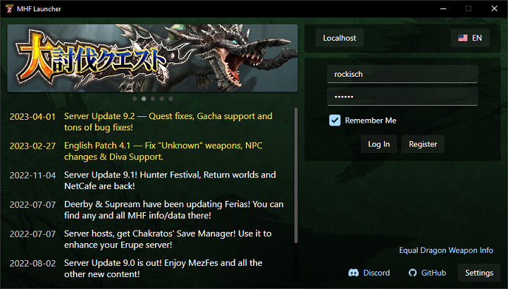
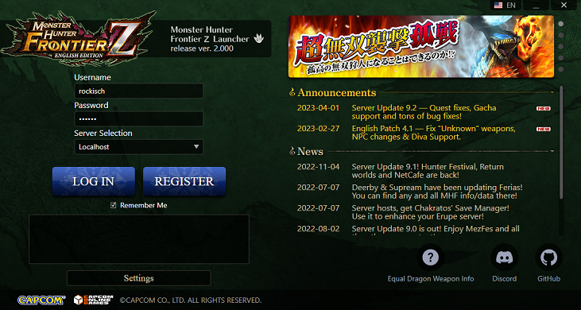
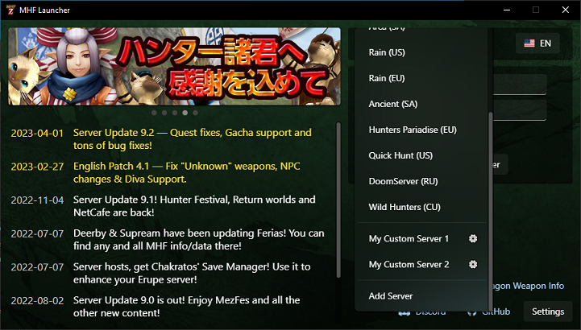
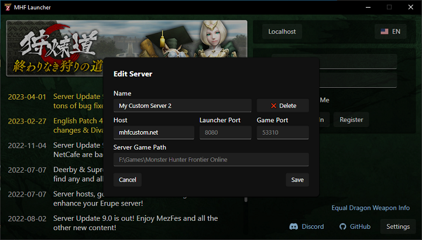

# MHF Launcher

A custom Monster Hunter Frontier launcher.

    

## Features

- Boots much faster than the original
- Includes a Modern and a Classic style
    

        
    

- Multi-language support (currently EN and JP)
- Allows you to add and manage multiple custom servers without editing '/etc/hosts'
    

        
        
    

- Allows you to download your character
- Allows servers to customize what icons and messages their users will see

## Usage

Download the [latest release](https://github.com/rockisch/mhf-launcher/releases/latest) and drop it in the same folder as `mhf.exe`.

Note that the launcher requires your `mhfo-hd.dll` to be decrypted. Most community releases in the wild already do that, so it probably won't be an issue.

## Supported Servers

For now, only servers using the latest version of [this fork](https://github.com/rockisch/Erupe-1) will work with the new launcher.
